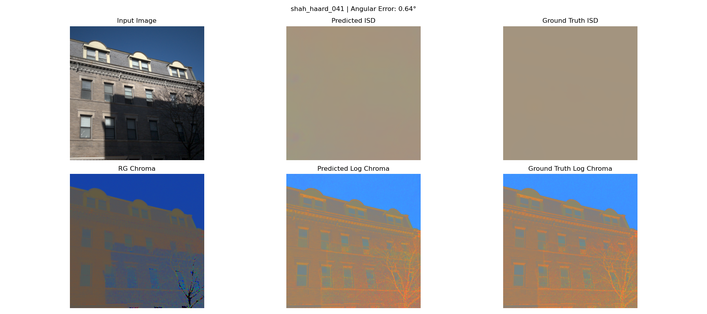

# Shadow removal via Illuminant Spectral Direction(ISD) estimation

We aim to recover the true scene appearance by eliminating cast shadows while preserving material color. This would improve the downstream computer vision tasks such as autonomous driving.

---

## 📌 Overview

- We developed an annotation tool for labeling raw 16-bit linear images
- Customized Model: MambaVision Backbone + Feature Pytramid Network like dense regression head.
- End-to-End pipeline: Annotation tool + Model Assembling + training & Evalutaion

---

## 🎬 Log Chromiticity Image using ISD Map

  

  

